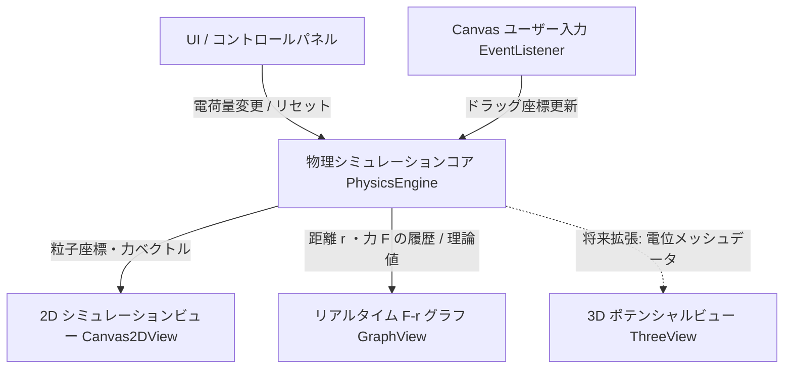
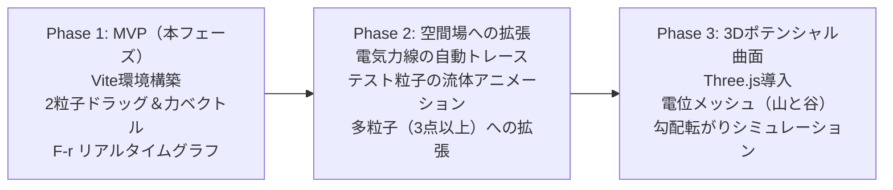

# クーロンの法則 Webシミュレーター 開発計画書

## 1. プロジェクト基本方針

* **対象ユーザー**: 高校物理〜大学教養課程の学習者・教育者
  * 直感的な操作感（ドラッグによる電荷移動、符号切り替え）
  * 数式・物理法則（逆二乗則 $F \propto 1/r^2$、作用・反作用）の定量的理解
* **技術スタック**:
  * **ビルドツール**: Vite + TypeScript
  * **レンダリング**: HTML5 Canvas 2D（MVPの粒子・力ベクトル・リアルタイムグラフ）
  * **3D拡張基盤**: Three.js（フェーズ3のポテンシャル曲面に対応可能な疎結合設計）
  * **スタイリング**: クリーンなモダンUI（CSS Modules / スレートダークテーマ）

---

## 2. アーキテクチャ設計

### モジュール構成
1. **`src/physics/`**:
   * `Particle.ts`: 粒子の位置 $\boldsymbol{r}$、電荷量 $q$、固定フラグ等のデータ構造
   * `CoulombEngine.ts`: クーロン力計算 $F = k \frac{q_1 q_2}{r^2}$、ベクトルの方向算出、発散防止処理（最小距離しきい値 $r_{\min}$、クランプ・ソフトニング）
2. **`src/render/`**:
   * `Canvas2DView.ts`: 荷電粒子（プラス: 赤、マイナス: 青）、作用・反作用の力ベクトル（矢印）、距離ガイドラインの描画
   * `GraphView.ts`: 理論曲線 $F(r) = k \frac{|q_1 q_2|}{r^2}$ の描画と、現在の実測動作点 $(r, F)$ のリアルタイムプロット
3. **`src/ui/`**:
   * 電荷 $q_1, q_2$ のスライダー操作・符号反転トグル
   * 定数 $k$ の調整や単位スケール切り替え

---

## 3. 数理モデルと描画の安定化設計

1. **クーロン力の計算**:
   $$\boldsymbol{F}_{1 \to 2} = k \frac{q_1 q_2}{\|\boldsymbol{r}_2 - \boldsymbol{r}_1\|^2} \hat{\boldsymbol{r}}_{1 \to 2}$$
   * 作用・反作用: $\boldsymbol{F}_{2 \to 1} = -\boldsymbol{F}_{1 \to 2}$

2. **ゼロ距離発散の防止（Softening Parameter / Clamp）**:
   * 粒子同士が重なった際の力発散を防ぐため、ソフトニング距離 $\epsilon$ または最小距離 $r_{\min}$ を導入：
     $$F = k \frac{q_1 q_2}{r^2 + \epsilon^2}$$
   * 矢印の描画長さに上限リミット（最大ピクセル長 $L_{\max}$）または準対数スケーリングを適用。

3. **$F$-$r$ グラフの可視化**:
   * 横軸 $r$（距離）、縦軸 $F$（力の大きさ）。
   * 背景に理論カーブを滑らかに描画し、現在状態を示すマーカーをアニメーション追従。
   * 引力（負/下向き）と斥力（正/上向き）の視覚的区別。

---

## 4. 段階的実装ロードマップ

### Phase 1: MVP（完了）
* [x] Vite + TypeScript プロジェクト初期化
* [x] 物理エンジン実装（2粒子の相対距離、クーロン力、作用反作用、発散防止）
* [x] 2Dインタラクティブキャンバス（Retina対応、ドラッグ＆ドロップ、力ベクトル矢印、距離表示）
* [x] $F$-$r$ グラフ描画モジュール（反比例理論曲線と現在動作点マーカーのリアルタイム同期）
* [x] 操作パネル（$q_1, q_2$ スライダー、±反転トグル、プリセット、グリッド/ベクトル表示切替）

### Phase 2: 場の可視化（完了）
* [x] グリッド状の電場ベクトル（矢印の向きと強さのカラーマップ・ログ圧縮輝度）
* [x] 電気力線（Field lines）の数値積分生成（Runge-Kutta 2次法、電荷比例の本数、方向矢印）
* [x] テスト微粒子の放出と運動シミュレーション（運動方程式 $F=qE$、粘性減衰、軌跡トレイル、極性切替、Shift+クリック配置）
* [x] Phase 2 E2E自動テスト作成・全通過（`e2e/field.spec.ts` を含む計13テスト合格）

### Phase 3: 3Dポテンシャル曲面（完了）
* [x] Three.js による電位 $V(x, y) = \sum k \frac{q_i}{r_i}$ のハイトマップ・ワイヤーフレーム描画（山: 正電位、谷: 負電位、カラーマップ、3D粒子球体）
* [x] 2D平面ビュー、3D電位曲面ビュー、スプリット（2D + 3D並列）表示のタブ切り替え
* [x] 3Dクイック操作（ワイヤーフレーム切替、自動回転、カメラ視点リセット、OrbitControls によるマウス回転・ズーム）
* [x] Phase 3 E2E自動テスト作成・全通過（`e2e/three_view.spec.ts` を含む計18テスト合格）

---

## 5. テスト・品質保証方針
* E2E自動テスト戦略・シナリオ定義: [e2e_testing_strategy.md](file:///C:/Users/drago/projects/physics/agentDocs/e2e_testing_strategy.md) を参照

