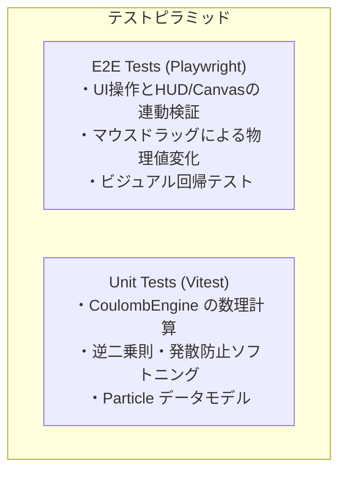
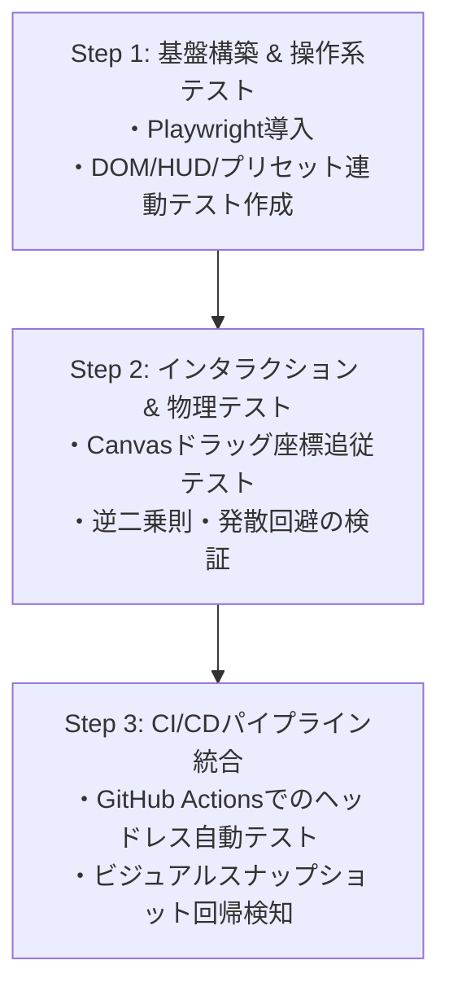

# クーロンシミュレーター E2Eテスト戦略設計書 (E2E Testing Strategy)

## 1. 概要と目的

本ドキュメントは、クーロンの法則 インタラクティブ・シミュレーター（`coulomb-simulator`）における **End-to-End (E2E) テスト戦略** を定義します。

HTML5 Canvas によるグラフィック描画（粒子・力ベクトル・リアルタイムグラフ）と、DOM によるUIコントロール群（スライダー・プリセット・HUD）が密連動するWebアプリケーションの特性を踏まえ、**テストの安定性（Flakiness防止）** と **物理モデルの正確性** を両立させるテスト体制を構築します。

---

## 2. 推奨テストフレームワーク: Playwright

E2E自動テスト基盤として **[Playwright](https://playwright.dev/)** を採用します。

### 採用理由
1. **高精度なポインター・マウスエミュレーション**:
   Canvas 2D 上でのマウス移動、ドラッグ開始、移動追従、ドラッグ解除（`mouse.move`, `down`, `up`）を高精度に制御可能。
2. **ビジュアル回帰テスト機能の標準搭載**:
   Canvas 描画要素のピクセルレベルでのスナップショット比較（`toHaveScreenshot()`）が容易。
3. **高速・高信頼なマルチブラウザ実行**:
   Chromium, Firefox, WebKit の各エンジンで同一スクリプトを実行可能。
4. **Vite 開発環境との高い親和性**:
   `playwright.config.ts` の `webServer` オプションにより、Vite 開発サーバー（`npm run dev`）の自動起動・終了をシームレスに統合可能。
5. **テストデバッグ環境（UI Mode / Trace Viewer）**:
   タイムラプス再生やドラッグイベントのトレースが容易。

---

## 3. テストピラミッドと E2E の責務



- **Unit Test (単体テスト)**: 数式計算（$F = k \frac{q_1 q_2}{r^2 + \epsilon^2}$）の境界値・精度・ソフトニング計算を検証。
- **E2E Test (本戦略)**: ユーザーが実際にブラウザで行う操作（ドラッグ、スライダー変更、プリセット押下）に対して、HUD表示、描画状態、物理法則の整合性が崩れないことをブラウザ実行環境で担保。

---

## 4. E2Eテストシナリオ設計

### ① DOM コントロールと HUD 連動テスト（操作系）
UI操作に対して、HUDの数値や状態ラベルが即座に正しく更新されるかを検証します。

| ID | テスト対象 | 操作手順 | 期待される動作・検証内容 |
| :--- | :--- | :--- | :--- |
| **TC-DOM-01** | 電荷スライダー連動 | `#q1-slider` の値を変更 | `#q1-val-display` に符号付き電荷量が即座に反映され、`#hud-force-val` の力の大きさも追従更新される |
| **TC-DOM-02** | 符号反転（±反転） | `#q1-toggle-sign` をクリック | バッジ表示（`#q1-badge`）の正負記号が切り替わり、引力・斥力ラベル（`#hud-force-type`）が適切に反転する |
| **TC-DOM-03** | プリセット切り替え | `#preset-attract`, `#preset-repel`, `#preset-ratio` をクリック | 既定の電荷量・極性・位置が正しくセットされ、表示とHUDが連動する |
| **TC-DOM-04** | 初期配置リセット | `#preset-reset` をクリック | 初期パラメータ（$q_1=+2.0\,\mu\text{C}, q_2=-2.0\,\mu\text{C}$）および初期座標に復元される |
| **TC-DOM-05** | 中性状態（$0\,\mu\text{C}$） | いずれかの電荷を $0$ に設定 | `#hud-force-val` が `0.00 N` となり、状態表示が「力なし (中性)」となる |

### ② Canvas ドラッグ操作と物理法則（インタラクション系）
Canvas上の粒子をポインタで掴んで移動させたときの物理挙動を検証します。

| ID | テスト対象 | 操作手順 | 期待される動作・検証内容 |
| :--- | :--- | :--- | :--- |
| **TC-CANVAS-01** | 粒子接近時の力の増加 | $q_1$ を $q_2$ の方向へドラッグ | 粒子間距離 $r$ が縮小し、力 $F$ が急激（逆二乗則 $1/r^2$）に増加する |
| **TC-CANVAS-02** | 粒子離隔時の力の減衰 | $q_1$ を $q_2$ から遠ざける | 粒子間距離 $r$ が拡大し、力 $F$ が減衰する |
| **TC-CANVAS-03** | 作用・反作用の整合性 | 任意位置への移動後 | 2粒子が受ける力の大きさが等しく、向きが正反対に維持されていること（破綻や非数 NaN が生じない） |
| **TC-CANVAS-04** | 画面境界・ドラッグ解除 | Canvas外枠近傍へドラッグしてマウスアップ | 意図しない座標飛びが発生せず、安全にドラッグが解除される |

### ③ 表示トグルとレイアウト
- **TC-VIEW-01**: グリッド表示トグル（`#chk-grid`）および力ベクトル表示トグル（`#chk-vectors`）の切り替えが正常に描画フラグに反映されること
- **TC-VIEW-02**: ウィンドウリサイズ時に Canvas の解像度とアスペクト比が適切に再計算されること

### ④ ビジュアル回帰テスト (Visual Regression)
Canvas描画の破損（矢印が消える、フォント崩れ、グラフの軸描画崩れ）を自動検出します。
- 初期配置時のシミュレーションCanvas・グラフCanvasのスナップショット比較
- アニメーションパルス等が存在する場合は固定タイマーまたはスナップショット比較オプションで許容差を設定

---

## 5. テスト容易性（Testability）の向上施策

Canvasを扱うアプリケーションでは、DOMセレクタだけでは内部状態を捕捉しにくい場合があります。テストの安定性を高めるため、以下の設計を取り入れます。

1. **`data-testid` の整備**:
   - IDセレクタの変更に依存しないよう、テスト対象の主要UIに `data-testid` 属性を付与。
2. **テスト用グローバルフックの露出（開発・テストモード時）**:
   - `window.__SIM_STATE__` を介して、現在の粒子配列 `particles`、計算結果 `ForceResult` を直接参照・アサート可能にするフックを用意。これによりCanvasの再描画を待たずに物理ステートの正確なアサーションが可能となります。

---

## 6. ディレクトリ構造と設定構成案

### 推奨ディレクトリ構成
```text
coulomb-simulator/
├── e2e/
│   ├── fixtures/             # 共通フィクスチャ・ヘルパー関数
│   ├── controls.spec.ts      # UIコントロール・HUD連動テスト
│   ├── interaction.spec.ts   # Canvasドラッグ・物理挙動テスト
│   └── visual.spec.ts        # ビジュアル回帰スナップショットテスト
├── agentDocs/
│   ├── coulomb_simulator_plan.md
│   └── e2e_testing_strategy.md   # 本ドキュメント
├── playwright.config.ts      # Playwright設定
└── package.json
```

### 設定ファイル例 (`playwright.config.ts`)
```typescript
import { defineConfig, devices } from '@playwright/test';

export default defineConfig({
  testDir: './e2e',
  fullyParallel: true,
  forbidOnly: !!process.env.CI,
  retries: process.env.CI ? 2 : 0,
  workers: process.env.CI ? 1 : undefined,
  reporter: 'html',
  use: {
    baseURL: 'http://localhost:5173',
    trace: 'on-first-retry',
    screenshot: 'only-on-failure',
  },
  projects: [
    {
      name: 'chromium',
      use: { ...devices['Desktop Chrome'] },
    },
    {
      name: 'firefox',
      use: { ...devices['Desktop Firefox'] },
    },
    {
      name: 'webkit',
      use: { ...devices['Desktop Safari'] },
    },
  ],
  webServer: {
    command: 'npm run dev',
    url: 'http://localhost:5173',
    reuseExistingServer: !process.env.CI,
    timeout: 120 * 1000,
  },
});
```

### サンプルテスト実装 (`e2e/controls.spec.ts`)
```typescript
import { test, expect } from '@playwright/test';

test.describe('クーロンシミュレーター コントロール・HUD連動テスト', () => {
  test.beforeEach(async ({ page }) => {
    await page.goto('/');
  });

  test('初期配置のHUD情報が正しく表示されていること', async ({ page }) => {
    await expect(page.locator('#sim-canvas')).toBeVisible();
    await expect(page.locator('#graph-canvas')).toBeVisible();
    await expect(page.locator('#hud-force-val')).not.toHaveText('0.00 N');
    await expect(page.locator('#hud-force-type')).toHaveText('引力（引き合う）');
  });

  test('プリセットボタンクリックで同符号（斥力）に切り替わること', async ({ page }) => {
    await page.click('#preset-repel');
    await expect(page.locator('#hud-force-type')).toHaveText('斥力（反発する）');
    await expect(page.locator('#q1-val-display')).toHaveText('+2.0 μC');
    await expect(page.locator('#q2-val-display')).toHaveText('+2.0 μC');
  });

  test('符号反転トグルで斥力から引力へ切り替わること', async ({ page }) => {
    await page.click('#preset-repel'); // 同符号 (+, +)
    await page.click('#q2-toggle-sign'); // q2 反転 (+, -)
    await expect(page.locator('#hud-force-type')).toHaveText('引力（引き合う）');
  });
});
```

### サンプルドラッグテスト実装 (`e2e/interaction.spec.ts`)
```typescript
import { test, expect } from '@playwright/test';

test.describe('Canvas 粒子ドラッグ操作テスト', () => {
  test('粒子を近づけるとクーロン力が増加すること (逆二乗則)', async ({ page }) => {
    await page.goto('/');

    const canvas = page.locator('#sim-canvas');
    const box = await canvas.boundingBox();
    if (!box) throw new Error('シミュレーションCanvasが見つかりません');

    // 初期状態の力を取得
    const initialForceText = await page.locator('#hud-force-val').textContent();
    const initialDistText = await page.locator('#hud-dist-val').textContent();

    // q1初期位置 (x: 260, y: 260) から q2 (x: 520, y: 260) 方向へドラッグ移動
    await page.mouse.move(box.x + 260, box.y + 260);
    await page.mouse.down();
    await page.mouse.move(box.x + 400, box.y + 260, { steps: 10 });
    await page.mouse.up();

    // 移動後の距離と力を検証
    const newForceText = await page.locator('#hud-force-val').textContent();
    const newDistText = await page.locator('#hud-dist-val').textContent();

    expect(newDistText).not.toEqual(initialDistText);
    expect(newForceText).not.toEqual(initialForceText);
  });
});
```

---

## 7. 導入ロードマップ



- **Step 1 (クイックウィン)**: Playwright を導入し、UIコントロールとHUD表示の疎通テストを自動化。
- **Step 2 (コア物理検証)**: Canvasマウスイベントの自動操作により、粒子の移動と物理計算の整合性を網羅。
- **Step 3 (CI自動化)**: Pull Request 時にヘッドレス実行を行い、回帰バグの混入をゼロにする。
