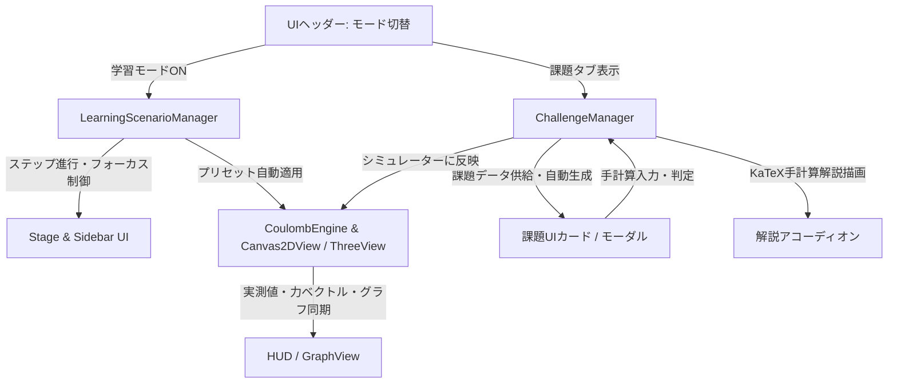

# クーロンの法則 探究学習モード＆演習課題・解説システム 実装計画書

## 1. 概要と目的

本計画は、ブランチ `feature/interactive-learning-mode` において、高校生が初めてクーロンの法則を学ぶための**「対話型探究学習シナリオ（チュートリアル・ガイド）」**および**「自動採点・手計算ステップ解説付き演習課題システム」**をWebシミュレーターに実装することを目的とします。

### 本機能の3大コアバリュー
1. **迷わないステップバイステップ探究（Learning Mode）**:
   * 自由実験だけでなく、「作用・反作用の発見」「逆二乗則の体感」「3D電位の空間把握」を順序立てて案内するインタラクティブガイド。
2. **定着を図る演習課題（Practice Challenges）**:
   * 典型的な定期テスト・共通テストレベルの課題群に加え、数値ランダム生成（無制限に練習可能）に対応。
3. **自己解決を促す手計算ステップ解説（Step-by-Step Solutions）**:
   * 答え合わせだけでなく、「単位換算（$\mu\text{C} \to \text{C}$）」「公式への代入」「指数の分離計算法」をKaTeX数式で美しく展開。
   * 「シミュレーターで再現」ボタンで、自分の手計算結果を即座に動く実験機上で目視確認可能。

---

## 2. システム構成とUI/UXアーキテクチャ



### ディレクトリ構成案
```text
src/
├── learning/
│   ├── LearningScenario.ts    # 4段階の学習ステップ定義、案内ポップアップ、進行管理
│   ├── ChallengeTypes.ts       # 課題の型定義（問題文、パラメータ、解答、解説ステップ）
│   ├── ChallengeManager.ts    # プリセット課題、ランダム問題生成、判定ロジック、解説生成
│   └── ScenarioData.ts        # 各ステップの案内テキスト・ハイライト対象・推奨操作
├── physics/
│   ├── CoulombEngine.ts       # 既存の物理演算コア
│   ├── Particle.ts
│   └── TestParticle.ts
├── render/
│   ├── Canvas2DView.ts
│   ├── GraphView.ts
│   └── ThreePotentialView.ts
├── main.ts                    # 各モジュールの統括とイベントリスナー設定
└── style.css                  # ガイドバナー、課題カード、解説ボックスのスタイリング
```

---

## 3. 実装詳細

### (1) 対話型学習モード（Learning Mode / Scenario Walkthrough）
画面上部ヘッダーに「🎓 学習モード」「🧪 自由実験モード」の切り替えスイッチを設置。

* **Step 1: 符号と作用・反作用の発見**
  * 目標: 異符号・同符号での向きの違いと、電荷量が違っても受ける力が等しい（ニュートン第3法則）ことを発見。
  * 自動アクション: プリセット「電荷差（+4μC & +1μC）」を強調・自動適用し、力ベクトルの矢印にフォーカス。
* **Step 2: 逆二乗則（距離と力）の体得**
  * 目標: 距離 $r$ をドラッグして、2倍で $1/4$、半分で $4$ 倍になる急激な変化を $F$-$r$ グラフ上で確認。
  * 自動アクション: グラフカードをハイライトし、現在動作点（プロット点）がカーブ上を動くヒントを表示。
* **Step 3: 空間のイメージ（電場と3D電位）**
  * 目標: 電気力線の向きと、正電荷（山）・負電荷（谷）におけるテスト粒子の運動を結びつける。
  * 自動アクション: スプリット表示（2D+3D）に切り替え、電気力線をON、「テスト電荷を放出」を促す。
* **Step 4: 自力手計算への橋渡し**
  * 目標: 演習課題タブを開き、実際に紙とペンで計算してシミュレーターで検証する流れを促す。

---

### (2) 演習課題（課題）＆ステップ解説（Solutions）システム

サイドバーまたは上部タブに **「📝 演習課題 & 答え合わせ」** パネルを設置。

#### ① プリセット課題ラインナップ
1. **課題 1 [入門: 異符号の引力と基本代入]**
   * 設定: $q_1 = +2.0\,\mu\text{C},\ q_2 = -3.0\,\mu\text{C},\ r = 1.00\,\text{m}$
   * 問い: 2つの電荷間に働く力の大きさ $F$ [N] と、引力・斥力の別を答えよ。
   * 正解: $F \approx 0.054\,\text{N}$（引力）
2. **課題 2 [基本: 同符号の斥力と逆二乗則]**
   * 設定: $q_1 = +4.0\,\mu\text{C},\ q_2 = +2.0\,\mu\text{C},\ r = 2.00\,\text{m}$
   * 問い: 力の大きさ $F$ [N] を求めよ。
   * 正解: $F \approx 0.018\,\text{N}$（斥力）
3. **課題 3 [応用: 距離の半減と力の跳ね上がり]**
   * 設定: 課題2の配置から距離を $r = 0.50\,\text{m}$（$1/4$ の距離）に縮めたときの力を求めよ。
   * 正解: $F \approx 0.288\,\text{N}$（$2.00\text{m}$ のときの16倍）
4. **課題 4 [発展: 極端な電荷差と作用・反作用]**
   * 設定: $q_1 = +10.0\,\mu\text{C},\ q_2 = +1.0\,\mu\text{C},\ r = 1.50\,\text{m}$
   * 問い: 電荷 $q_1$ が受ける力と $q_2$ が受ける力の大きさをそれぞれ求めよ。
   * 正解: どちらも $F \approx 0.040\,\text{N}$（等しい）

#### ② ランダム課題ジェネレーター
* 「🎲 新しい問題を生成」ボタンを押すと、$q_1, q_2 \in \{-10, \dots, +10\}\setminus\{0\}\,\mu\text{C}$、$r \in [0.4, 2.5]\,\text{m}$ の範囲でランダムに作問。
* 自動的に理論値 $F = k \frac{|q_1 q_2|}{r^2}$ と解説ステップを生成。

#### ③ 手計算自動判定と「シミュレーターで再現」
* ユーザーは数値（有効数字2〜3桁）と「引力 / 斥力」ラジオボタンを選択して送信。
* 許容誤差 $\pm 5\%$ 以内で「正解！🎉」を判定。
* 「🔬 シミュレーターで再現」ボタンをクリックすると、現在のキャンバスに課題の電荷・距離を即座にセットし、計測値と自分の計算結果が一致することを実体験。

#### ④ KaTeXによる手計算ステップ解説（折りたたみアコーディオン）
* **Step 1: 単位の換算**:
  $$\mu\text{C} = 10^{-6}\,\text{C}$$
* **Step 2: 公式への代入**:
  $$F = \left(9.0 \times 10^9\right) \times \frac{|(+2.0 \times 10^{-6}) \times (-3.0 \times 10^{-6})|}{(1.00)^2}$$
* **Step 3: 指数と係数の分離計算**:
  $$F = \frac{9.0 \times 2.0 \times 3.0}{1.00^2} \times 10^{9 - 6 - 6} = 54.0 \times 10^{-3} = 0.054\,\text{N}$$

---

## 4. E2Eテスト方針 (`e2e/learning.spec.ts`)

Playwrightによる自動テストで以下を担保：
1. 学習モードのON/OFF切り替えとバナー表示
2. Step 1〜Step 4 の「次へ」「前へ」進行とハイライト要素・自動設定
3. 演習課題タブの開閉とプリセット課題の切り替え
4. 正解・不正解の手計算入力に対するフィードバック判定
5. 「シミュレーターで再現」ボタン押下時の物理エンジン・HUD連動
6. KaTeX数式解説アコーディオンの展開・描画確認
