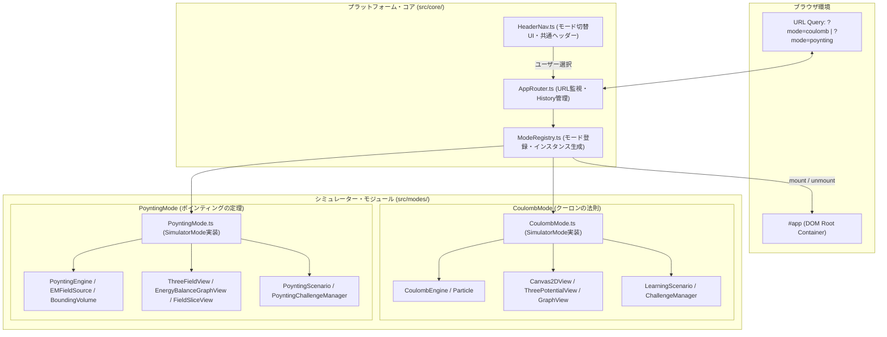
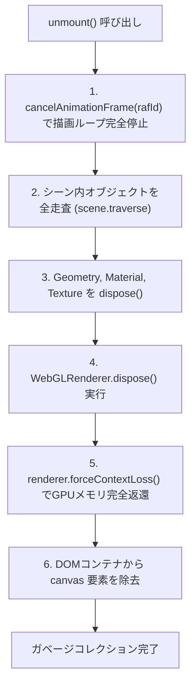
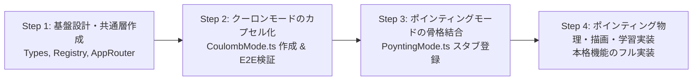

# マルチモード物理シミュレーター基盤 アーキテクチャ設計書
## (Multi-Mode Physics Platform Architecture & Migration Plan)

---

## 1. 背景と目的

現在のプロジェクトは「クーロンの法則」単体のシミュレーターとして実装されていますが、新たに「ポインティングの定理・電磁場エネルギーシミュレーター」を追加し、将来的にも光学・波動・量子力学などの新単元を追加可能な**「マルチモード物理シミュレーター基盤（Multi-Mode Physics Platform）」**へと拡張します。

### マルチモード化の要件
1. **完全な責務分離と状態の独立性**:
   * クーロンシミュレーターとポインティングシミュレーターが互いのグローバル変数やCanvasコンテキスト、イベントリスナーを一切汚染しない設計。
2. **WebGL / Canvasリソースの完全なライフサイクル管理**:
   * モード切替時に、旧モードの `requestAnimationFrame` ループ停止、Three.jsシーン・ジオメトリ・テクスチャ・WebGLコンテキストの破棄（`dispose()` / `forceContextLoss()`）、DOMイベントリスナーの解除を徹底し、メモリリークやGPUクラッシュを根絶。
3. **URL同期とディープリンク**:
   * `?mode=coulomb` や `?mode=poynting` により、特定モードへの直リンクおよびブラウザの「戻る・進む」に対応。
4. **既存資産の互換性維持（Zero-Regression）**:
   * 既存のクーロンシミュレーターのE2Eテスト（Playwright全26テスト）が回帰を起こさずにそのまま動作し続けること。

---

## 2. プラットフォーム・アーキテクチャ



---

## 3. インターフェース定義 (`src/core/Types.ts`)

すべてのシミュレーターモードは、共通のライフサイクル規約を持つ `SimulatorMode` インターフェースを実装します。

```typescript
export interface SimulatorModeMetadata {
  readonly id: string;            // 'coulomb' | 'poynting'
  readonly name: string;          // 'クーロンの法則' | 'ポインティングの定理'
  readonly englishTitle: string;  // "Coulomb's Law" | "Poynting's Theorem"
  readonly icon: string;          // '⚡' | '🌊'
  readonly subtitle: string;      // 数式や要約
  readonly description: string;
}

export interface SimulatorMode {
  readonly metadata: SimulatorModeMetadata;

  /**
   * モード起動時に呼び出される。
   * 専用DOM構造の構築、Canvas/Three.jsの初期化、イベントリスナーの登録、描画ループ開始を行う。
   */
  mount(container: HTMLElement): Promise<void> | void;

  /**
   * 別のモードへ切り替わる際に必ず呼び出される。
   * requestAnimationFrame停止、Three.js全リソース解放、イベントリスナー解除、DOMクリアを行う。
   */
  unmount(): void;

  /**
   * ウィンドウリサイズ時のコールバック
   */
  resize?(width: number, height: number): void;

  /**
   * タブバックグラウンド移行時のポーズ/再開制御
   */
  pause?(): void;
  resume?(): void;
}
```

---

## 4. WebGL / Canvas リソース破棄とメモリ管理

SPA（シングルページアプリケーション）においてThree.jsのシーンを破棄する際、単純にDOMを削除するだけではWebGLコンテキストやテクスチャメモリがGPU側に残留し、クラッシュ（`CONTEXT_LOST_WEBGL`）を引き起こします。  
本基盤では、`ThreeDisposer` ユーティリティにより以下のステップを厳格に実行します。



```typescript
// src/common/ThreeDisposer.ts
import * as THREE from 'three';

export function disposeThreeScene(
  renderer: THREE.WebGLRenderer,
  scene: THREE.Scene
): void {
  scene.traverse((object) => {
    if ((object as THREE.Mesh).isMesh) {
      const mesh = object as THREE.Mesh;
      mesh.geometry?.dispose();
      if (Array.isArray(mesh.material)) {
        mesh.material.forEach((mat) => mat.dispose());
      } else if (mesh.material) {
        mesh.material.dispose();
      }
    }
  });
  renderer.dispose();
  renderer.forceContextLoss();
  const domElement = renderer.domElement;
  if (domElement.parentElement) {
    domElement.parentElement.removeChild(domElement);
  }
}
```

---

## 5. UIレイアウトとモード切替バー

ヘッダー最上部に直感的な「モードスイッチャー」を配置し、現在のモードをハイライト表示します。

```html
<!-- ヘッダー内のモードスイッチャー -->
<nav class="mode-nav-tabs" role="tablist">
  <button type="button" class="mode-tab active" data-mode="coulomb" role="tab">
    <span class="mode-tab-icon">⚡</span>
    <span class="mode-tab-label">クーロンの法則</span>
    <span class="mode-tab-tag">静電場</span>
  </button>
  <button type="button" class="mode-tab" data-mode="poynting" role="tab">
    <span class="mode-tab-icon">🌊</span>
    <span class="mode-tab-label">ポインティングの定理</span>
    <span class="mode-tab-tag">電磁エネルギー流</span>
  </button>
</nav>
```

### URL ルーティングとディープリンクの動作仕様
1. **初回アクセス (`/` またはパラメータなし)**:
   * デフォルトモード（`coulomb`）を起動。
   * `history.replaceState` により URL を `/?mode=coulomb` に正規化。
2. **特定モード指定 (`/?mode=poynting`)**:
   * 直接「ポインティングの定理」モードをマウント。
3. **タブクリック時**:
   * 現在のモードの `unmount()` を完了。
   * `history.pushState` でURL更新。
   * 新モードの `mount()` を実行。
4. **ブラウザの「戻る」「進む」（`popstate` イベント）**:
   * URLパラメータの変化を検知し、自動的に該当モードへとクリーンに切り替え。

---

## 6. ディレクトリ構造の再編（マイグレーション案）

既存のフラットな `src/` 配下を、共通基盤 (`common/`, `core/`) と各モード (`modes/coulomb/`, `modes/poynting/`) へ整理します。

```text
src/
├── common/                     # 全モード共通のユーティリティ
│   ├── KaTeXHelper.ts          # 数式レンダリング・ホバーハイライト基盤
│   ├── ThreeDisposer.ts        # Three.js メモリ・コンテキスト解放
│   └── CanvasUtils.ts          # 高DPI（Retina）対応Canvasスケーラー
├── core/                       # プラットフォーム統括
│   ├── Types.ts                # SimulatorMode, ModeMetadata インターフェース
│   ├── ModeRegistry.ts         # モードの登録・一覧保持
│   ├── AppRouter.ts            # URL query (`?mode=...`) 監視・ルーティング
│   └── HeaderNav.ts            # モード切替タブ・ヘッダー描画
├── modes/
│   ├── coulomb/                # クーロンの法則シミュレーター（既存コードを移設）
│   │   ├── physics/
│   │   │   ├── CoulombEngine.ts
│   │   │   ├── Particle.ts
│   │   │   └── TestParticle.ts
│   │   ├── render/
│   │   │   ├── Canvas2DView.ts
│   │   │   ├── GraphView.ts
│   │   │   └── ThreePotentialView.ts
│   │   ├── learning/
│   │   │   ├── LearningScenario.ts
│   │   │   ├── ChallengeManager.ts
│   │   │   ├── ChallengeTypes.ts
│   │   │   └── ScenarioData.ts
│   │   └── CoulombMode.ts      # SimulatorMode 実装エントリーポイント
│   └── poynting/               # ポインティングの定理シミュレーター（新規実装）
│       ├── physics/
│       │   ├── PoyntingEngine.ts
│       │   ├── EMFieldSource.ts
│       │   └── BoundingVolume.ts
│       ├── render/
│       │   ├── ThreeFieldView.ts
│       │   ├── EnergyBalanceGraphView.ts
│       │   └── FieldSliceView.ts
│       ├── learning/
│       │   ├── PoyntingScenario.ts
│       │   ├── PoyntingChallengeManager.ts
│       │   ├── PoyntingChallengeTypes.ts
│       │   └── PoyntingScenarioData.ts
│       └── PoyntingMode.ts      # SimulatorMode 実装エントリーポイント
├── main.ts                     # プラットフォーム初期化とAppRouter起動
└── style.css                   # 共通CSSおよびモード別スタイル
```

---

## 7. 段階的マイグレーション計画



1. **Step 1: プラットフォーム層の導入**:
   * `src/core/Types.ts`, `src/core/ModeRegistry.ts`, `src/core/AppRouter.ts` を作成。
2. **Step 2: 既存のクーロンシミュレーターを `CoulombMode` にパッケージ化**:
   * 既存の `src/main.ts` 内のDOM操作・イベントハンドラを `src/modes/coulomb/CoulombMode.ts` 内に集約。
   * Playwrightテストを実行し、クーロンシミュレーターの全26テストが一切の変更なし（またはセレクタ互換性維持）で100%成功することを確認。
3. **Step 3: ポインティングシミュレーターの骨格をマルチモード基盤に登録**:
   * `PoyntingMode.ts` を作成し、タブ切り替えUIで両者を行き来できることを確認。
   * WebGLコンテキストの解放テストを行い、メモリリークゼロを確認。
4. **Step 4: ポインティングモードの本格実装**:
   * `EMFieldSource.ts`、`BoundingVolume.ts`、`ThreeFieldView.ts`、`EnergyBalanceGraphView.ts` を順次実装。
