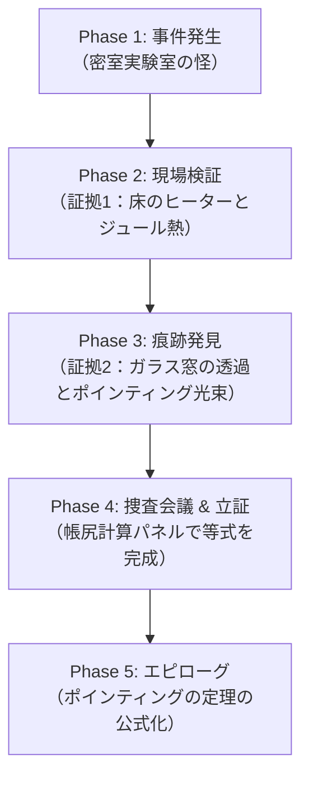
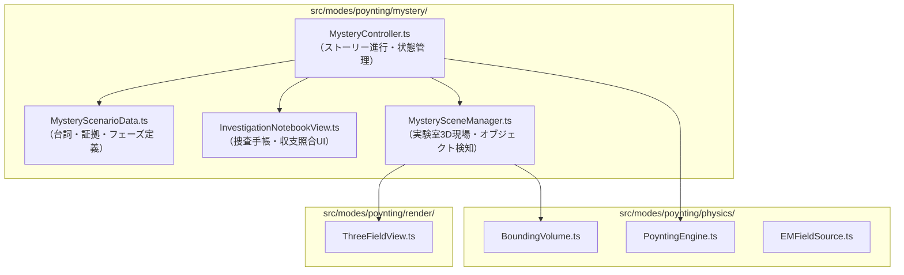

# インタラクティブ・ミステリーノベル型教材 開発計画書
## 「密室から消えた 80 ジュールの謎 〜エネルギー消失事件の捜査〜」

---

## 1. 企画背景と教育的狙い

### (1) 背景と課題
従来の理系向け物理教育では、ポインティングの定理を次のような数式から導入することが一般的です：
$$\frac{\partial u}{\partial t} + \nabla \cdot \boldsymbol{S} = -\boldsymbol{j} \cdot \boldsymbol{E}$$
しかし、このアプローチは数学的抽象度が高く、特に文系選択者や初学者にとって「なぜこのような式を考える必要があるのか」「右辺と左辺は何を言っているのか」という**動機（Why）**が見えにくく、挫折しやすいという課題があります。

### (2) ミステリーノベル型の狙い
* **「消えた 80 J を追う」という明確な目標**:
  「100 J あったエネルギーが 20 J に減った。消えた 80 J はどこへ行ったのか？」という密室ミステリーの形式を取ることで、数式の丸暗記ではなく**論理的推論・証拠集めのプロセス**として物理法則にアプローチします。
* **歴史的動機の追体験**:
  ジョン・ヘンリー・ポインティングがこの定理を構築した背景には、「場（空間）に蓄えられたエネルギーの時間変化と、物質が受け取る仕事、境界から流出するエネルギーの帳尻を合わせる」という強い要請がありました。ユーザーは探偵となって事件を捜査することで、この「帳尻合わせ＝エネルギー保存則」を自然に体得します。

---

## 2. ストーリーラインとゲームフェーズ



### 【プロローグ / Phase 1: 事件発生】
* **舞台**: 先端電磁気学研究所・第3隔離実験室（体積 $V$ の完全密閉箱）。
* **状況**:
  * 初期状態（$t=0$）: 密閉箱の中に高周波電磁場エネルギー **$W(0) = 100 \text{ J}$** をチャージ。
  * 5秒後（$t=5$）: 電磁場センサーが検知した残存エネルギーは **$W(5) = 20 \text{ J}$**。
  * **「密室から 80 J が忽然と消失した！」**
* **プレイヤーのミッション**:
  探偵（電磁捜査官）として実験室内外を調査し、消えた 80 J の行方を特定してエネルギー保存則を証明せよ。

### 【Phase 2: 現場検証 — 証拠1の発見】
* **インタラクション**: 3D実験室内をクリックして怪しい箇所を調べる。
* **発見箇所**: 実験室の床に敷設された導線・負荷ヒーター。
* **証拠1のデータ**:
  * ヒーターが赤熱しており、熱探知カメラで測定すると $30 \text{ J}$ の熱エネルギーが発生していた。
  * 物理メモ: 電流 $\boldsymbol{j}$ と電場 $\boldsymbol{E}$ の積（内部仕事・ジュール熱）：
    $$\int_0^5 dt \int_V \boldsymbol{j} \cdot \boldsymbol{E} \, dV = 30 \text{ J}$$
* **捜査手帳の進捗**:
  * 消失総量: $80 \text{ J}$
  * 判明分: ヒーター熱 $-30 \text{ J}$
  * **未解決の謎: 残り $50 \text{ J}$ はどこへ！？（密室の壁は頑丈で破られていない）**

### 【Phase 3: 痕跡発見 — 証拠2の発見】
* **インタラクション**: 実験室の壁面を「ルーペ・UVライト（電磁波可視化）モード」で精密スキャン。
* **発見箇所**: 南側壁面の一角にある観測用石英ガラス窓（境界面 $\partial V$）。
* **証拠2のデータ**:
  * 石英窓の表面に電磁波の通過痕跡（外向きのベクトル束）を感知。
  * ポインティング・ベクトル $\boldsymbol{S} = \frac{1}{\mu_0}(\boldsymbol{E} \times \boldsymbol{B})$ が外向きに噴出していたことが判明。
  * 窓表面の積分（エネルギー流束）：
    $$\int_0^5 dt \oint_{\text{window}} \boldsymbol{S} \cdot d\boldsymbol{A} = 50 \text{ J}$$
* **捜査手帳の進捗**:
  * $30 \text{ J} \text{ (熱)} + 50 \text{ J} \text{ (電磁波流出)} = 80 \text{ J}$！
  * ピッタリ 80 J の消失分と一致！

### 【Phase 4: 立証 — エネルギー保存則の構築】
* **インタラクション（証拠照合パネル）**:
  捜査手帳の証拠チップをドラッグ＆ドロップして、エネルギー収支の帳尻を合わせる。
  $$[ -80 \text{ J} ] = - [ 30 \text{ J} ] - [ 50 \text{ J} ]$$
  $$\underbrace{\Delta W}_{\text{室内の減少}} = - \underbrace{\int \boldsymbol{j}\cdot\boldsymbol{E}}_{\text{床の熱}} - \underbrace{\oint \boldsymbol{S}\cdot d\boldsymbol{A}}_{\text{窓から逃げた光}}$$

### 【Phase 5: エピローグ — ポインティングの定理の導出】
* 微小時間 $\Delta t \to dt$、微小体積要素への分解を経て、物理学者ポインティングが導いた定理そのものへと昇華。
* 「エネルギーは消えたのではなく、姿を変えて逃げていただけだった」というカタルシスを提供。

---

## 3. UI/UX デザイン設計

### (1) 画面レイアウト構成案
```
+-----------------------------------------------------------------------------+
| [モード切替: クーロン | ポインティング | ★ミステリー捜査]   [BGM/SE: On/Off] |
+------------------------------------+----------------------------------------+
|                                    | 【捜査手帳 & 証拠ボード】 (右ペイン)   |
| 【3D事件現場ビュー (Three.js)】    | -------------------------------------- |
|                                    | 案件: #080 密室エネルギー消失事件      |
|  - 密閉された実験室（透過ボックス）| 初期エネルギー: 100 J                  |
|  - クリック可能な現場オブジェクト: | 現在のエネルギー: 20 J (-80 J 消失)    |
|    [1] 床のヒーター                | -------------------------------------- |
|    [2] 壁の石英窓                  | 【発見した証拠品】                     |
|    [3] 電磁場発信アンテナ          | [証拠1: ジュール熱 30 J] (床)          |
|                                    | [証拠2: ポインティング流束 50 J] (窓)  |
|  - カーソル切替ツールバー:         | -------------------------------------- |
|    [通常矢印] [虫眼鏡] [UVライト]  | 【収支計算・告発スロット】             |
|                                    |  ΔW = - ∫(j・E) - ∮(S・dA)             |
|                                    |  [-80] = - [ 30 ] - [ 50 ]             |
|                                    |  [ 捜査完了・真相を立証するボタン ]   |
+------------------------------------+----------------------------------------+
| 【ノベル対話ウィンドウ (下部)】                                             |
| 助手「警部！室内のエネルギーが80Jも消えています！熱力学の破綻でしょうか…？」 |
| 探偵（あなた）「慌てるな。エネルギー保存則は絶対だ。必ず現場に抜け穴がある。」 |
+-----------------------------------------------------------------------------+
```

### (2) インタラクション演出
1. **虫眼鏡モード (Loupe Inspection)**:
   マウスカーソルが虫眼鏡になり、壁や窓に近づけるとベクトル線（$\boldsymbol{E}\times\boldsymbol{B}$）が光り輝くシェーダーエフェクト。
2. **証拠獲得時の演出**:
   「証拠入手！」のSEとともに、手帳パネルに証拠カードがスロットイン。
3. **推論チェック（立証ギミック）**:
   文系生徒が直感的に理解できるよう、数式記号と日常言語の対応ラベル（「床が吸った熱」「窓から漏れた光」「部屋の残量」）を併記。

---

## 4. システムアーキテクチャ・モジュール連携

既存の `src/modes/poynting/` の設計を活かし、学習レイヤーに「Mystery」サブモジュールを追加します。



### 新規追加ファイル候補:
* `src/modes/poynting/mystery/MysteryTypes.ts`:
  捜査フェーズ、証拠カード（EvidenceItem）、ダイアログ（DialogueMessage）の型定義。
* `src/modes/poynting/mystery/MysteryScenarioData.ts`:
  100J $\to$ 20J の事件データ、キャラクターの会話スクリプト、証拠定義。
* `src/modes/poynting/mystery/MysterySceneManager.ts`:
  Three.js シーン内に「床のヒーターメッシュ」「窓メッシュ」「証拠クリック判定（Raycaster）」を注入・管理。
* `src/modes/poynting/mystery/InvestigationNotebookView.ts`:
  DOM操作による捜査手帳UI、証拠リスト、エネルギー帳尻合わせパネル。
* `src/modes/poynting/mystery/MysteryController.ts`:
  ミステリーモード全体の進行制御、クリックイベントのハンドリング、解決判定。

---

## 5. 実装ロードマップ

* **Step 1: データ構造 & 型定義の設計**
  * `MysteryTypes.ts`, `MysteryScenarioData.ts` の作成。
  * 100J $\to$ 20J、床ヒーター 30J、窓透過 50J の数値整合性の定義。
* **Step 2: 3D事件現場（実験室）の構築**
  * `MysterySceneManager.ts` で直方体の部屋、床ヒーター、ガラス窓の3Dオブジェクト配置と Raycaster によるクリック検出。
* **Step 3: ノベル風ダイアログ & 捜査手帳 UI の実装**
  * 下部メッセージウィンドウと右側捜査手帳パネルのスタイリング・レンダリング。
* **Step 4: 証拠照合 & 事件解決ギミック**
  * 証拠品をドラッグ／クリックしてポインティング方程式の枠を埋め、一致した際に「事件解決！」演出を発火。
* **Step 5: 結合テスト & UIブラッシュアップ**
  * モード切替からの起動確認、レスポンシブ対応、E2Eテストでの動作担保。
