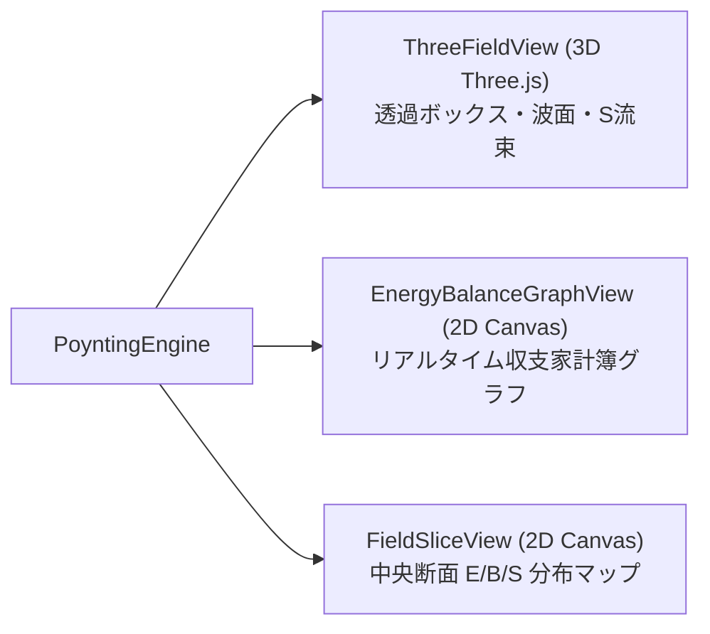
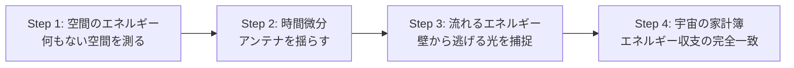

# ポインティングの定理・電磁場エネルギーシミュレーター 開発計画書
## (Poynting Energy Simulator & Multi-Mode Platform Master Plan)

---

## 1. プロジェクト基本方針

* **目的**: 
  大学電磁気学および高校物理発展・大学教養課程において最も抽象度が高いとされる**「電磁場のエネルギー保存則（ポインティングの定理）」**を、誰でも直感的に視覚・触覚で理解できるWebシミュレーターとして実現する。
* **主要テーマ**:
  1. **空間そのものがエネルギーを保持していること**（エネルギー密度 $u = \frac{1}{2}\varepsilon_0 E^2 + \frac{1}{2\mu_0} B^2$）
  2. **エネルギーが光の速度で空間を流れていくこと**（ポインティング・ベクトル $\boldsymbol{S} = \frac{1}{\mu_0}(\boldsymbol{E} \times \boldsymbol{B})$）
  3. **宇宙の家計簿（局所的・大局的エネルギー収支）**：
     $$\frac{dW}{dt} = - \int_V \boldsymbol{j} \cdot \boldsymbol{E} \, dV - \oint_{\partial V} \boldsymbol{S} \cdot d\boldsymbol{A}$$
* **技術スタック**:
  * **言語・ビルド**: Pure TypeScript + Vite（React等のヘビーフレームワークを使わず、低遅延・高FPSを維持）
  * **3D描画**: Three.js（透過バウンディングボックス、電磁場波面、`InstancedMesh` ポインティングベクトル、流出エネルギー粒子）
  * **2D描画**: HTML5 Native Canvas 2D（リアルタイム収支家計簿グラフ、中央断面 $\boldsymbol{E}/\boldsymbol{B}$ 複合ベクトルスライス）
  * **数式エンジン**: KaTeX + KaTeX Auto-Render（双方向ホバーハイライト、直感日本語トグル対応）
  * **プラットフォーム**: 既存の「クーロンの法則シミュレーター」とシームレスに共存する**マルチモード（Multi-Mode）基盤**

---

## 2. システムアーキテクチャ

既存のクーロンシミュレーターで実証された「MVC / レイヤード設計」を完全継承し、物理計算・マルチビュー描画・学習機能・UIオーケストレーターを明確に分離します。

```mermaid
flowchart TD
    subgraph UI_Layer ["プレゼンテーション & UI層 (src/modes/poynting/ui/)"]
        Controls["コントロールパネル (周波数・振幅・境界箱サイズ)"]
        Main["PoyntingController.ts (Mode Controller & Event Bus)"]
        KaTeXUI["KaTeX Math HUD (数式 ⇄ 直感日本語トグル & 双方向ホバー)"]
    end

    subgraph Physics_Layer ["物理シミュレーション層 (src/modes/poynting/physics/)"]
        Engine["PoyntingEngine.ts (場・エネルギー・流束の統合計算)"]
        Field["EMFieldSource.ts (ヘルツ双極子放射 / 電線・抵抗ジュール熱 / 平面波)"]
        Volume["BoundingVolume.ts (領域 V と境界面 ∂V の数値積分・フラックス計算)"]
    end

    subgraph Render_Layer ["レンダリング層 (src/modes/poynting/render/)"]
        View3D["ThreeFieldView.ts (Three.js: 透過境界箱・波面メッシュ・Sベクトル・発光壁)"]
        ViewGraph["EnergyBalanceGraphView.ts (Canvas 2D: リアルタイム収支家計簿スタックグラフ)"]
        ViewSlice["FieldSliceView.ts (Canvas 2D: アンテナ中央断面のE/Bベクトル分布)"]
    end

    subgraph Learning_Layer ["探究学習 & 演習課題層 (src/modes/poynting/learning/)"]
        Scenario["PoyntingScenario.ts (4段階対話型ストーリー)"]
        Challenge["PoyntingChallengeManager.ts (収支クイズ・直感判定・自動採点)"]
        Data["PoyntingScenarioData.ts / PoyntingChallengeTypes.ts"]
    end

    Controls -->|スライダー / 時間停止 / 視点切替| Main
    Main -->|境界箱サイズ・周波数・波源パラメータ変更| Engine
    Engine --> Field
    Engine --> Volume

    Engine -->|3D電磁場・Sベクトル・境界透過フラックス| View3D
    Engine -->|エネルギー収支データ (W, dW/dt, ∫S, ∫j・E)| ViewGraph
    Engine -->|中央断面のE/Bベクトル分布| ViewSlice

    Main <--> Scenario
    Main <--> Challenge
    Challenge --> KaTeXUI
    KaTeXUI -->|ホバーイベント (数式パーツ ⇄ 3Dハイライト)| Main
    Main -->|境界箱やS粒子の発光指示| View3D
```

---

## 3. 数理モデルと物理計算コア (`src/modes/poynting/physics/`)

高校生・大学初年次の対話型アプリでは、重い3D-FDTD（格子差分時間領域法）を回すとフレームレートが低下し、ユーザー操作への追従性が損なわれます。  
本シミュレーターでは、**60FPSで軽快に動作する「解析解（ヘルツ双極子・電線モデル）」＋「リアルタイム空間数値積分」**を採用します。

### (1) ポインティングの定理の数学的定式化
電磁場エネルギー密度 $u$ およびポインティング・ベクトル $\boldsymbol{S}$：
$$u(\boldsymbol{r}, t) = \frac{\varepsilon_0}{2} \|\boldsymbol{E}(\boldsymbol{r}, t)\|^2 + \frac{1}{2\mu_0} \|\boldsymbol{B}(\boldsymbol{r}, t)\|^2$$
$$\boldsymbol{S}(\boldsymbol{r}, t) = \frac{1}{\mu_0} \left( \boldsymbol{E}(\boldsymbol{r}, t) \times \boldsymbol{B}(\boldsymbol{r}, t) \right)$$

マクスウェル方程式より導かれる微分形：
$$\frac{\partial u}{\partial t} + \nabla \cdot \boldsymbol{S} = -\boldsymbol{j} \cdot \boldsymbol{E}$$

これを閉領域 $V$（境界面 $\partial V$、外向き法線ベクトル $\hat{\boldsymbol{n}}$）で体積積分した積分形（本シミュレーターの検証対象）：
$$\underbrace{\frac{dW}{dt}}_{\text{領域内のエネルギー増減}} = - \underbrace{\int_V \boldsymbol{j} \cdot \boldsymbol{E} \, dV}_{\text{荷電粒子・抵抗器への仕事（ジュール熱）}} - \underbrace{\oint_{\partial V} \boldsymbol{S} \cdot d\boldsymbol{A}}_{\text{境界壁から外部へ逃げたエネルギー流束}}$$
ここで、$W(t) = \int_V u(\boldsymbol{r}, t) \, dV$ である。

---

### (2) 電磁場ソースモデル (`EMFieldSource.ts`)

#### ① 振動電気双極子（微小アンテナ / ヘルツ双極子）モデル
原点に置かれた双極子モーメント $\boldsymbol{p}(t) = p_0 \cos(\omega t) \hat{\boldsymbol{z}}$ による電磁波放射。  
波長 $\lambda = \frac{2\pi c}{\omega}$、遅延時間 $t_r = t - \frac{r}{c}$、波数 $k = \frac{\omega}{c}$ とすると、球座標 $(r, \theta, \phi)$ における厳密解は：

$$E_r = \frac{2 p_0 \cos\theta}{4\pi\varepsilon_0} \left( \frac{\cos(\omega t_r)}{r^3} - \frac{k \sin(\omega t_r)}{r^2} \right)$$
$$E_\theta = \frac{p_0 \sin\theta}{4\pi\varepsilon_0} \left( \frac{\cos(\omega t_r)}{r^3} - \frac{k \sin(\omega t_r)}{r^2} - \frac{k^2 \cos(\omega t_r)}{r} \right)$$
$$B_\phi = \frac{\mu_0 p_0 \omega \sin\theta}{4\pi} \left( - \frac{\sin(\omega t_r)}{r^2} - \frac{k \cos(\omega t_r)}{r} \right)$$
$$E_\phi = 0, \quad B_r = 0, \quad B_\theta = 0$$

* **近傍領域 ($r \ll \lambda$)**: 静電双極子場（$1/r^3$）が支配的。エネルギーは外へ逃げず、アンテナ周辺を行ったり来たりする（無効電力成分）。
* **遠方放射領域 ($r \gg \lambda$)**: 放射項（$1/r$）が支配的となり、$E_\theta$ と $B_\phi$ が同位相で直交し、ポインティング・ベクトル $\boldsymbol{S}$ が外向き正（$1/r^2$ で減衰、全立体角積分は距離によらず一定保存）となる。
* **教育的価値**: 「近くだとエネルギーが呼吸のように出入りするが、遠くへ行くと外へ飛び去って二度と戻らない」現象を完全再現。

#### ② 直流電線・抵抗器モデル（エネルギーの吸い込み）
* 円柱導線（半径 $a$、長さ $L$）に電流 $I$ が $+z$ 方向に流れている場合：
  * 導線表面での電場: 抵抗率 $\rho$ により $\boldsymbol{E} = \frac{V_{\text{drop}}}{L} \hat{\boldsymbol{z}}$
  * 導線表面での磁場: アンペールの法則より $\boldsymbol{B} = \frac{\mu_0 I}{2\pi a} \hat{\boldsymbol{\phi}}$
  * ポインティング・ベクトル:
    $$\boldsymbol{S} = \frac{1}{\mu_0}(\boldsymbol{E} \times \boldsymbol{B}) = \frac{V_{\text{drop}} I}{2\pi a L} (-\hat{\boldsymbol{r}})$$
  * 表面積 $2\pi a L$ を内向きに貫く総エネルギー流束:
    $$\oint \boldsymbol{S} \cdot (-d\boldsymbol{A}) = V_{\text{drop}} \cdot I = \text{ジュール熱 } P_{\text{Joule}}$$
* **教育的価値**: 「電池から出たエネルギーは電線の中を通るのではなく、電線の周りの空間を通って抵抗器の側面に吸い込まれる」という、物理専攻生すら驚くパラドックスを可視化。

---

### (3) バウンディングボックスと空間積分コア (`BoundingVolume.ts`)

ユーザーがスライダーで幅・奥行き・高さを自由に変更できる直方体領域：
$$V = [x_{\min}, x_{\max}] \times [y_{\min}, y_{\max}] \times [z_{\min}, z_{\max}]$$

1. **境界面 $\partial V$ の流束積分 $\oint_{\partial V} \boldsymbol{S} \cdot d\boldsymbol{A}$**:
   * 直方体の6面（$\pm X, \pm Y, \pm Z$ 面）について、各面を $N \times N$ のガウス・ルジャンドルまたはグリッド点に分割し、面法線ベクトル $\hat{\boldsymbol{n}}_k$ との内積 $\boldsymbol{S} \cdot \hat{\boldsymbol{n}}_k$ を数値積分。
   * 毎フレーム計算結果を `fluxOut` として出力。
2. **領域内の総エネルギー $W(t) = \int_V u \, dV$**:
   * 領域 $V$ を $M_x \times M_y \times M_z$ のサンプリングボクセルに分割し、エネルギー密度 $u$ を体積積分。
   * 前後フレームの差分から時間変化率 $\frac{\Delta W}{\Delta t}$ を算出。
3. **収支整合性（エネルギー保存エラー判定）**:
   $$\text{Residual}(t) = \frac{\Delta W}{\Delta t} + \int_V \boldsymbol{j} \cdot \boldsymbol{E} \, dV + \oint_{\partial V} \boldsymbol{S} \cdot d\boldsymbol{A}$$
   計算誤差が $\pm 2\%$ 以内に収まるようサンプリング数を最適化（WebWorkerへのオフロードも視野）。

---

## 4. マルチビュー・レンダリング設計 (`src/modes/poynting/render/`)



### (1) `ThreeFieldView.ts` (Three.js 3D表示)
* **透過バウンディングボックス ($V$)**:
  * ユーザーが操作可能な半透明直方体。
  * エッジはクリーンなライン描画。
  * **動的発光演出 (Wall Flash Effect)**: エネルギーが外へ逃げた瞬間、通過した面の透明度・輝度が一瞬パルス状に上昇（「壁から光が抜けた！」ことが直感的にわかる）。
* **ポインティング・ベクトル ($\boldsymbol{S}$) 矢印群**:
  * `THREE.InstancedMesh` を用いて、数百〜数千の3D矢印を高FPSで一括描画。
  * ベクトルの大きさに応じて矢印の長さとカラーマップ（暗青 $\to$ シアン $\to$ 黄 $\to$ 発光白）をリアルタイム更新。
* **エネルギー流出パーティクル (Energy Flux Particles)**:
  * 波源から生まれ、ポインティング・ベクトルの流れに沿って移動する光の粒子。
  * バウンディングボックスの境界面 $\partial V$ を越えた瞬間に色が変わる、または壁にインパクトエフェクトを残す。

### (2) `EnergyBalanceGraphView.ts` (Canvas 2D リアルタイム収支家計簿)
* 横軸を時間 $t$ としたリアルタイムスクロールグラフ。
* 3本の重要指標を同時描画：
  1. **箱の中のエネルギー残量 $W(t)$**（シアン線）
  2. **箱から外へ逃げた累積放射エネルギー $\int_0^t \left(\oint_{\partial V} \boldsymbol{S} \cdot d\boldsymbol{A}\right) dt$**（オレンジ線）
  3. **アンテナ/電線が供給した総仕事 $\int_0^t P_{\text{in}} dt$**（白点線）
* **積み上げ面グラフモード**:
  * 「現在の残量」＋「逃げた量」を積み上げると、波源の総供給エネルギーと**完全に水平一直線で一致**することを目撃させます。

### (3) `FieldSliceView.ts` (Canvas 2D 中央断面電磁場マップ)
* 3D空間の空間把握が難しいユーザー向けに、$y=0$ 平面（アンテナ軸を含む断面）を切り出した2D高精細キャンバス。
* 電場 $\boldsymbol{E}$（赤色ベクトル線）と磁場 $\boldsymbol{B}$（画面手前/奥を示す青色丸印記号 $\odot / \otimes$）を同時にオーバーレイ。
* 右手系（$\boldsymbol{E} \times \boldsymbol{B}$ の向き）と外向きポインティング・ベクトルの関係が2Dで即座に検証可能。

---

## 5. 教育特化UI/UX設計

### (1) 数式と3D空間の「双方向ホバーハイライト」
画面上部のKaTeX数式バーに配置された各要素にマウスを乗せると、対応する3D空間の構成要素がハイライトされます。

$$\frac{dW}{dt} = - \int_V \boldsymbol{j} \cdot \boldsymbol{E} \, dV - \oint_{\partial V} \boldsymbol{S} \cdot d\boldsymbol{A}$$

| KaTeX数式要素 | ホバー時の3D/2D画面連動演出 | 教育的意図 |
| :--- | :--- | :--- |
| $\boldsymbol{\frac{dW}{dt}}$ | 3D透過直方体の内部全体が青白く呼吸点滅。グラフの「残量 $W$」カーブが太線強調。 | 「箱の中にたまっているエネルギーの変化」であることを直感づける。 |
| $\boldsymbol{\oint_{\partial V} \boldsymbol{S} \cdot d\boldsymbol{A}}$ | 3D直方体の6枚の境界面と、壁を貫く外向きSベクトル矢印群だけがオレンジ色に発光。 | 「壁を突き破って宇宙へ逃げていく光の量」であることを理解させる。 |
| $\boldsymbol{\int_V \boldsymbol{j} \cdot \boldsymbol{E} \, dV}$ | 中心部のアンテナまたは抵抗器が赤熱し、ジュール熱パーティクルが立ち上る。 | 「電気エネルギーが熱や運動エネルギーに変換された分」であることを明示。 |

---

### (2) 「数式 ⇄ 直感日本語」トグルスイッチ
数式アレルギーを持つ文系高校生・初学者のために、ワンクリックで数式と日常語を相互変換できるトグルを常設します。

```text
[ 数式モード ]
  dW/dt = - ∫ (j · E) dV - ∮ (S · dA)

[ 直感日本語モード ]
  [箱の中の電気エネルギーの減り幅] ＝ [電線で熱になった分] ＋ [壁を突き破って逃げた光の量]
```

---

## 6. 4段階探究学習シナリオ (`PoyntingScenario.ts`)

高校生の学習心理に寄り添い、「何もない空間にエネルギーがある」というパラドックスから「エネルギー保存則の確認」までを4段階で誘導します。



* **Step 1: 見えない空間のエネルギーを測ってみよう（静電場・静磁場）**
  * 目標: 何もない真空の空間に、電場や磁場があるだけでエネルギー $W$ が蓄えられることを体感。
  * 操作: 電荷や磁石を近づけ、直方体 $V$ の内部にエネルギーメーターが蓄積されることを確認。
* **Step 2: 時間を動かしてみよう（時間変化と微分の意味）**
  * 目標: アンテナを振動させると、箱の中のエネルギー残量が激しく周期振動（微分 $\frac{dW}{dt} \neq 0$）し始める様子を観察。
  * 問い: 「波が広がっていくと、箱の中のエネルギーは増える？減る？」
* **Step 3: 壁から漏れ出る光を捕まえよう（ポインティング・ベクトルの登場）**
  * 目標: 波が箱の境界面 $\partial V$ を突き抜ける瞬間に壁が発光し、外向きフラックス $\oint \boldsymbol{S} \cdot d\boldsymbol{A}$ としてカウントされることを確認。
  * 驚きポイント: ベクトル $\boldsymbol{S}$ の向きが波の進む向き（光速 $c$）と完全に一致していることの発見。
* **Step 4: 宇宙の家計簿（エネルギー保存則の完全証明）**
  * 目標: 「箱の中の減少分」＝「壁から逃げた光」＋「消費された熱」が100%完全に一致することをグラフで検証。
  * チャレンジ: 箱の大きさを2倍、3倍に広げても、遠くの壁を通過するトータルの光エネルギーは変わらない（逆二乗則と表面積 $4\pi r^2$ の相殺）ことを発見する。

---

## 7. 演習課題・クイズシステム (`PoyntingChallengeManager.ts`)

1. **基本課題（引力・向き判定）**:
   * 「電線に電流が流れているとき、ポインティング・ベクトル $\boldsymbol{S}$ はどちらを向いているか？」（選択肢: 電流の向き / 電流と逆向き / 導線の中心に向かう向き / 外へ放射される向き）
2. **計算課題（放射仕事率の算出）**:
   * 球面または立方体を貫くポインティング・ベクトルの総束から、アンテナの全放射電力 $P = \oint \boldsymbol{S} \cdot d\boldsymbol{A}$ を計算し、手計算入力で解答。
3. **直感判定クイズ（家計簿パズル）**:
   * 箱の中のエネルギーが毎秒 $5\text{ W}$ 減少し、ジュール熱が $2\text{ W}$ 発生しているとき、壁から外へ漏れ出ているポインティング束は何ワットか？（答え: $3\text{ W}$）
   * KaTeXによるステップ解説を自動展開。

---

## 8. 実装ロードマップ

* [ ] **Phase 1: マルチモード基盤の構築**（詳細設計書: `agentDocs/multi_mode_architecture_plan.md`）
  * アプリ上部にモード切替ナビゲーションバー（⚡ クーロンの法則 $\leftrightarrow$ 🌊 ポインティングの定理）を新設
  * URLクエリパラメータ連動（`?mode=coulomb`, `?mode=poynting`）
  * 各モードのライフサイクル（初期化・破棄・WebGLリソース解放・描画ループ停止）管理
* [ ] **Phase 2: ポインティング物理エンジン実装**
  * `EMFieldSource.ts`: ヘルツ双極子解析解・電線モデル・平面波モデル
  * `BoundingVolume.ts`: 可変直方体メッシュ・6面ガウス数値積分・体積エネルギー密度積分
  * `PoyntingEngine.ts`: リアルタイム時間微分・収支整合性評価ループ
* [ ] **Phase 3: 3D / 2D マルチビューレンダリング**
  * `ThreeFieldView.ts`: 透過ボックス・`InstancedMesh` Sベクトル・境界壁フラッシュマテリアル
  * `EnergyBalanceGraphView.ts`: 収支積み上げリアルタイム面グラフ
  * `FieldSliceView.ts`: 2D中央断面 E/B マップ
* [ ] **Phase 4: 教育UI・KaTeX双方向連動・探究学習モード**
  * KaTeX数式バー ⇄ 3Dオブジェクトの双方向ホバーハイライト
  * 数式 ⇄ 直感日本語トグル
  * 4段階対話型シナリオ & 自動採点クイズ
* [ ] **Phase 5: Playwright E2E自動テスト・品質検証**
  * モード切り替え時のメモリリーク／WebGLコンテキスト生存テスト
  * ポインティング収支整合性の数値精度検証テスト
  * KaTeXホバーイベント・UIインタラクションE2Eテスト
