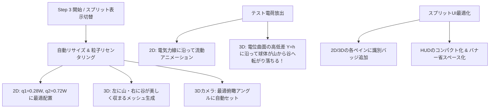

# Step 3 スプリット表示＆3D電位・テスト電荷シミュレーション 改善計画書

## 1. 現状の画面分析と課題（ユーザー・UI/UX専門家の視点）

Playwrightによる実機スクリーンショット（`STEP3-INITIAL.png`）および実測DOM/座標データ（`STEP3 DIAGNOSTIC STATE`）の分析により、以下の問題点を特定し改善しました。

| 領域 | 不具合・問題点 | 原因 | ユーザーへの影響 |
| :--- | :--- | :--- | :--- |
| **2Dキャンバス** | 負電荷 $q_2$ が画面外（右側）に消失し、画面内に正電荷 $q_1$ しか見えない | 全幅（~800px）時の座標（$x_2 = 584\text{px}$）のままスプリット表示（幅450px）に縮小されたため | 引き合う相手や電気力線の行き先が見えず、何が起きているか理解できない |
| **3D空間** | 3D電位曲面に正の「山」しかなく、負の「谷」が存在しない（平坦な斜面のみ） | 3Dハイトマップが2Dキャンバス幅（450px）を参照しており、$x_2 = 584\text{px}$ の負電荷が3Dメッシュ外に除外されたため | 「山から谷へ転がる」というシナリオの説明と実際の表示が完全に矛盾する |
| **3Dテスト粒子** | 「テスト電荷を放出」を押しても、3D画面側にはテスト粒子が一切表示されない | `ThreePotentialView` にテスト電荷の3Dメッシュ・描画ループが存在しないため | 3Dの山を転がり落ちる物理的直感が得られない |
| **UIオーバーレイ** | 2DのHUD（作用する力・距離）が280pxを占有し、450px幅の画面の半分以上を遮蔽 | 全幅表示前提のHUDスタイルがスプリット画面でもそのまま表示されているため | 電気力線や粒子とHUDが被り、極めて窮屈で見づらい |
| **縦方向の圧迫** | キャンバスの高さが272pxしかなく、上下に潰れた窮屈なアスペクト比 | 学習バナーの上下余白（~180px）が大きすぎ、ステージの高さを圧迫 | 視界が狭く、山と谷のダイナミックな高低差を感じられない |

---

## 2. UI/UX 改善方針（UI/UX Expert Perspective）

### 改善の3本柱
1. **完璧な画面収まり（Auto-Framing & Centering）**:
   * スプリット表示への切り替え時、およびStep 3開始時に、両粒子を $x_1 = 0.28W, x_2 = 0.72W, y = 0.52H$ に自動整列。
   * 2D画面でプラス・マイナスが美しく中央に並び、3D画面でも左側に「赤い山」、右側に「青い谷」が完璧な構図で現れるようにする。
2. **3Dテスト粒子の「転がり」リアルタイム同期（The "Rolling Ball" Effect）**:
   * `ThreePotentialView` にテスト粒子の3D球体群を追加。
   * 2Dの $(x, y)$ 移動と電位高さ $h(x, y)$ をリアルタイム連動させ、**山から谷へと重力でボールが滑り落ちるような劇的な可視化**を実現。
   * Step 3突入時にテスト粒子を自動放出し、開いた瞬間に「おおっ！」と直感できる演出を提供。
3. **スプリットモード専用のUIレイアウト最適化**:
   * 2DペインのHUDをコンパクトカード化（文字サイズ・パディング縮小）。
   * 各ペインの上部に「2D 電気力線・ベクトル」「3D 電位空間（山と谷）」の視認バッジを配置。
   * 学習バナーのレイアウトをスリム化し、キャンバス描画エリアの縦幅を拡大（272px $\to$ 360px+）。

---

## 3. 実装詳細

### (1) `src/render/Canvas2DView.ts`
* `fitParticlesToViewport(ratioX1 = 0.28, ratioX2 = 0.72, ratioY = 0.52)` メソッドの実装。
* キャンバス幅の急激な変化（スプリット切り替え）時に、粒子が画面外にはみ出さないクランプ処理を強化。
* テスト粒子のゲッター `getTestParticles()` の公開。

### (2) `src/render/ThreePotentialView.ts`
* **3Dテスト粒子の描画**:
  * `testParticleMeshes: THREE.Mesh[]` の管理。
  * アニメーションループ内で 2Dテスト粒子の $(x, y)$ を 3D座標 $(x_{3D}, h+4, z_{3D})$ に射影し、山から谷への滑走をレンダリング。
  * 発光マテリアル（正電荷: ネオンイエロー、負電荷: シアン）で視認性を最大化。
* **カメラ画角の最適化**:
  * スプリット表示時に山と谷の両方が中央にバランスよく収まるカメラ位置・注視点（$(0, 160, 240)$、`target = (0, -10, 0)`）を設定する `setOptimalSplitCamera()` メソッドの実装。

### (3) `src/learning/ScenarioData.ts` と `src/main.ts` の連携
* Step 3 の `autoSetup` で:
  * 粒子座標をスプリット表示の最適位置（$x_1 = 0.28W, x_2 = 0.72W$）へリセット。
  * 3Dカメラを最適アングルに設定。
  * テスト粒子を自動で3個スポーンさせ、即座に山から谷への滑走運動を開始。
* 3Dレンダラーの毎フレーム更新で、テスト粒子の3Dアニメーションを滑らかに同期。

### (4) `src/style.css` のUI調整
* `.canvas-wrapper.view-split` 時の `.canvas-overlay` スタイルを最適化（コンパクト化）。
* 各ペインのヘッダーバッジ（`pane-badge`）の追加。
* `.learning-banner` の上下パディング・行間をスリム化し、ステージの描画高さを拡大。

---

## 4. 検証・品質保証
* 診断スクリプトおよびE2Eテストを実行し、スクリーンショットを再取得して比較検証。
* 全26件のE2Eテストがパスすることを確認。
